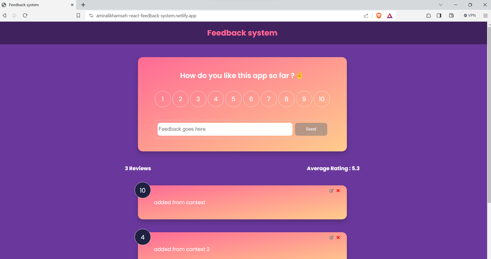

***Live demo : https://amiralikhamseh-react-feedback-system.netlify.app/***
# Feedback system 
The Feedback system is a modern React application that enables users to share their opinions and experiences regarding a product or service. It allows users to rate the product or service using numbers and leave comments. The application is built using a component-based architecture, which makes it easy to integrate with other web applications and provide a rating system solution to those systems.

# Technical objectives
This React application is designed with a focus on component-based architecture. It uses the Context API to manage global state and facilitate communication between components based on their side effects. The application also features real-time data validation for user inputs, and generates statistics based on overall ratings.

## Installation
- Make sure you have Node (v18.17.1 has been used on this project) installed on your system or download it from  https://nodejs.org/en. 

- Clone this repository or download the zip file .
- Open the terminal on the same directory and run the following commands to install the dependencies and run the project.
```
npm install
npm run start
```
